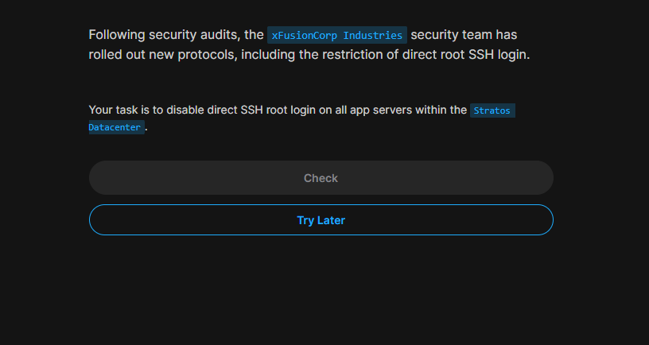

<div style="max-width: 800px; margin: 0 left;">

# Task 3 - Disable Direct SSH Root Login



## Problem Statement
Following security audits, the xFusionCorp Industries security team has rolled out new protocols, including the restriction of direct root SSH login. The task is to disable direct SSH root login on all app servers within the Stratos Datacenter.

## Environment Details
- **App Servers**: stapp01, stapp02, and stapp03
- **Operating System**: Linux (CentOS based)
- **SSH Service**: OpenSSH

## Security Objective
Prevent direct root login via SSH to enhance server security by:
- Forcing users to log in with personal accounts first
- Requiring privilege escalation through `sudo` or `su`
- Creating an audit trail of who accessed root privileges
- Reducing the attack surface for brute force attacks on the root account

## Solution Steps

### Step 1: Access the Server
```bash
# Connect to each app server as a regular user
ssh tony@stapp01
ssh steve@stapp02  
ssh banner@stapp03
```

### Step 2: Check Current SSH Configuration
```bash
# View the current SSH daemon configuration
sudo cat /etc/ssh/sshd_config

# Check the current PermitRootLogin setting
sudo grep -i "PermitRootLogin" /etc/ssh/sshd_config
```

### Step 3: Edit SSH Configuration
```bash
# Edit the SSH daemon configuration file
sudo vi /etc/ssh/sshd_config

# Find and modify the PermitRootLogin line:
# Change from: #PermitRootLogin yes
# Change to:   PermitRootLogin no
```

**Key Configuration Change:**
```
PermitRootLogin no
```

### Step 5: Restart SSH Service
```bash
# Method 1: Using systemctl (preferred)
sudo systemctl restart sshd

# Method 2: Using service command
sudo service sshd restart

# Method 3: Reload configuration without dropping connections
sudo systemctl reload sshd
```

## Files Modified
- `/etc/ssh/sshd_config` - Main SSH daemon configuration file

## Status: ✅ COMPLETED
**Verified On**: Verify on all app servers (stapp01, stapp02, stapp03)  

</div>